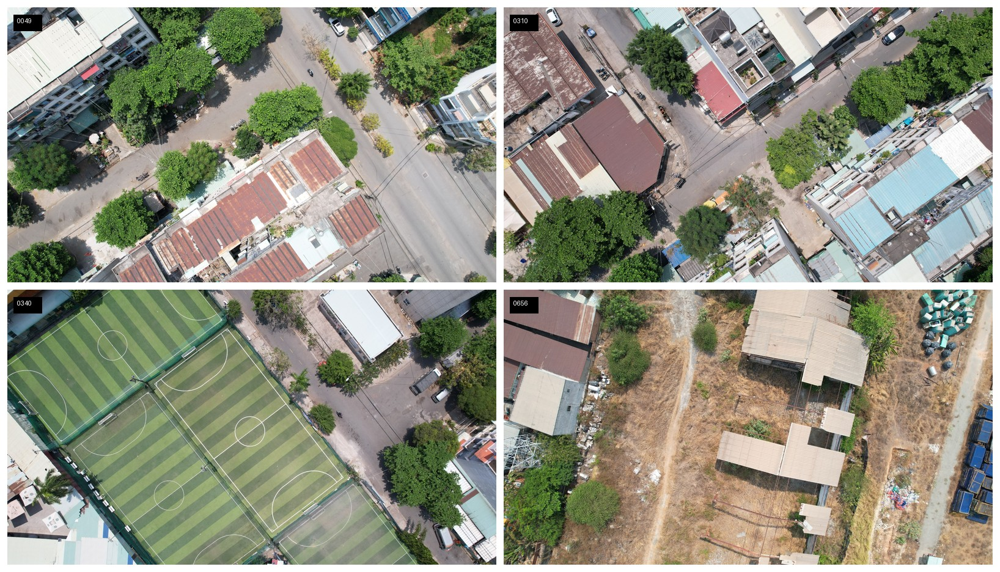
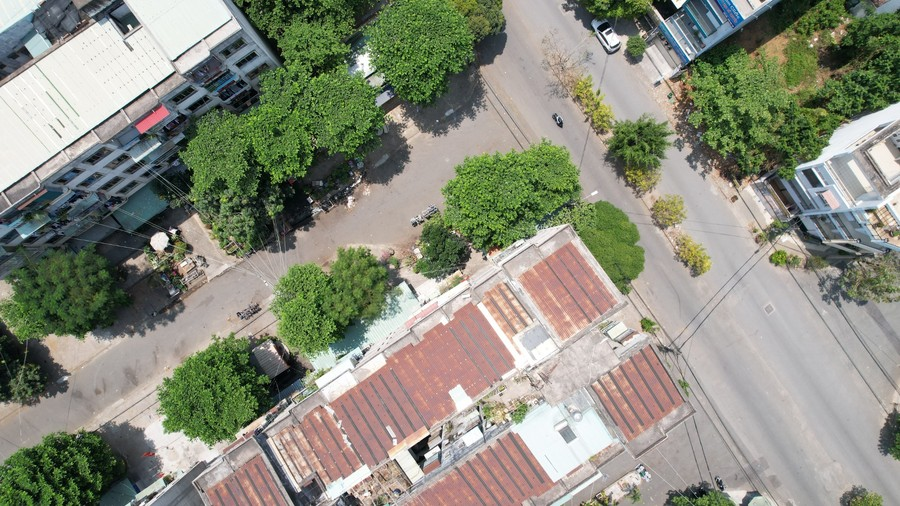
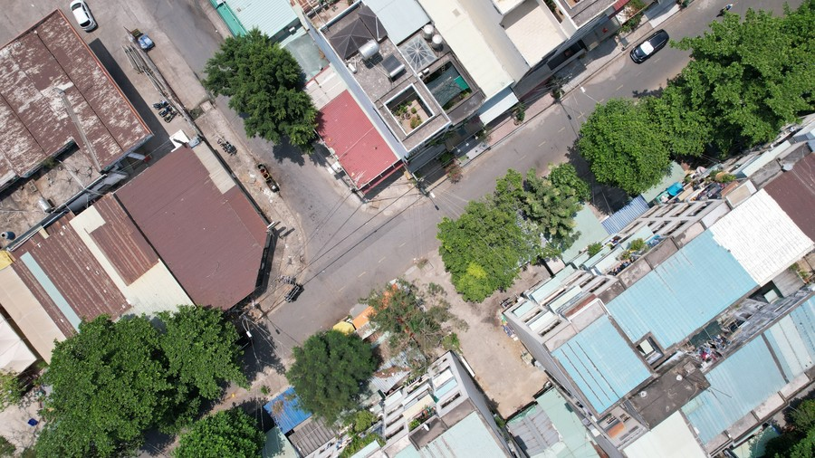
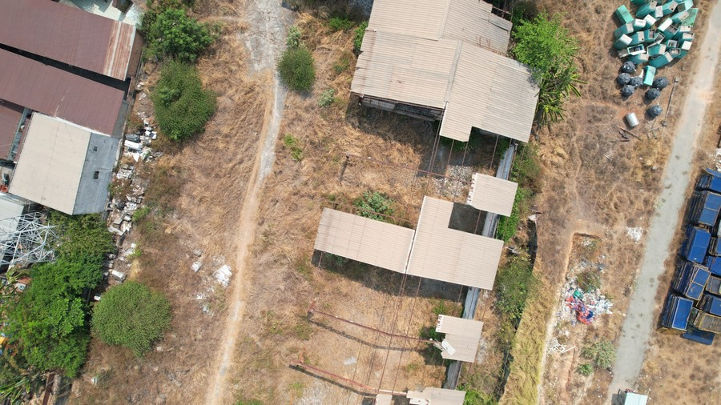

# HCMUT-UAV Dataset
**Ho Chi Minh City UAV Traffic Vehicle Detection Dataset (Dataset Release Repository)**

> Documentation + download links for the **HCMUT-UAV** object detection dataset.  
> The dataset files are hosted on **Google Drive**, while this GitHub repository stores documentation, metadata, and utility scripts.

<p align="center">
  
</p>

<p align="center"><em>Example UAV scenes from HCMUT-UAV.</em></p>

---

## Overview

**HCMUT-UAV** is a high-resolution UAV traffic dataset collected in **Ho Chi Minh City, Vietnam** for **vehicle object detection** in urban aerial scenes, with a focus on **small object and crowded-scene detection**.

This repository is intended to help users:

- understand the dataset scope and labeling scheme,
- download the dataset from Google Drive,
- verify image/XML filename pairing,
- optionally convert Pascal VOC XML annotations to COCO JSON for common detection frameworks.

> **Current public release packaging in this repository workflow:** `images/` + `annotations/` (Pascal VOC XML, one XML per image).  

---

## Dataset Summary

### Core Statistics (HCMUT-UAV)

| Property | HCMUT-UAV |
|---|---|
| Data source | UAV imagery (Ho Chi Minh City, Vietnam) |
| Images | **4,811** |
| Native resolution | **5,472 × 3,078** (≈ **16.84 MP**) |
| Classes | **2** (`car`, `motorbike`) |
| Annotated instances | **56,548** |
| Annotation type | Tight axis-aligned bounding boxes |
| Annotation format | COCO-style JSON `[x, y, w, h]` |
| Current public package format (this release) | Pascal VOC XML |

### Data Acquisition Specification (HCMUT-UAV)

| Factor | Setting | Why it matters for small object detection |
|---|---|---|
| Platform | **DJI Air 2S** | Realistic consumer-UAV deployment |
| Recording | **Video, 30 FPS** | Enables dense sampling and careful frame selection |
| Resolution | **5,472 × 3,078** | Preserves fine details for tiny vehicles |
| Altitude | **50–80 m** | Vehicles remain small at realistic monitoring heights |
| Scenes | Roads, intersections, mixed traffic flows | Naturally includes dense traffic regions |
| Conditions | Favorable weather, varied times of day | Reduces unusable frames while keeping illumination diversity |

### Category Definition (Compact 2-Class Label Space)

| Class | Description |
|---|---|
| `car` | Unified four-wheeled vehicle category (e.g., sedan, van, truck, bus) |
| `motorbike` | Two-wheeled motorized vehicles (e.g., scooter, motorcycle) |

---

## Example Images

<table>
  <tr>
    <td align="center"><br><sub>Sample 0049 — urban intersection / rooftop clutter</sub></td>
    <td align="center"><br><sub>Sample 0310 — tree occlusion / wide road scene</sub></td>
  </tr>
  <tr>
    <td align="center"><br><sub>Sample 0340 — dense urban block / narrow road</sub></td>
    <td align="center"><br><sub>Sample 0656 — mixed background clutter / open lot</sub></td>
  </tr>
</table>

> These images are included as **compressed previews only**. The full dataset should be downloaded from the official release link below.

---

## Repository Purpose (Important)

Because the dataset size is large (~38 GB), the dataset itself is **not stored on GitHub**.

This repository contains only:

- documentation (`README`, usage notes, release notes),
- metadata (`classes.txt`, split files, checksums),
- helper scripts (validation, format conversion),
- download links to Google Drive.

---

## Download

### Google Drive (Primary Distribution)

- **Google Drive folder:** `https://drive.google.com/drive/folders/1UH-eKIthvvx-A8K_2bxfrulebqbNSjoD?usp=drive_link`


---

## Public Release Folder Structure (XML Version)

After download and extraction, organize the dataset as follows:

```text
HCMUT-UAV/
├─ images/
│  ├─ 000001.jpg
│  ├─ 000002.jpg
│  └─ ... (4811 images)
├─ annotations/
│  ├─ 000001.xml
│  ├─ 000002.xml
│  └─ ... (4811 XML files)

```
---

## Annotation Format

### Current Public Release (XML)
- **Image files:** `.jpg`
- **Annotations:** **Pascal VOC XML** (one file per image)
- **Bounding boxes:** axis-aligned rectangles

### Optional COCO Conversion
This repo includes a helper script for converting VOC XML annotations to **COCO JSON** for MMDetection / Detectron2 / other common frameworks.

```bash
python scripts/voc_xml_to_coco.py \
  --images ./HCMUT-UAV/images \
  --annotations ./HCMUT-UAV/annotations \
  --output ./HCMUT-UAV/annotations_coco.json
```

---

## Quick Start for Users

### 1) Download and extract
Download all archive parts from Google Drive and extract into one `HCMUT-UAV/` directory.

### 2) Verify image/XML pairing
```bash
python scripts/check_dataset_pairs.py --images ./HCMUT-UAV/images --annotations ./HCMUT-UAV/annotations
```

### 3) (Optional) Convert XML → COCO JSON
Use the conversion script shown above.

---

## Suggested Split Protocol (Reference)

A split protocol in the thesis uses **disjoint flight segments** (to reduce near-duplicate leakage across train/validation/test):

- **Train:** 3,368 images
- **Validation:** 722 images
- **Test:** 721 images

---


## License


---

## Citation

If you use **HCMUT-UAV**, please cite:

1. This dataset repository
2. The corresponding thesis/dissertation


---

## Contact

- **Maintainer:** `Hoanh Nguyen`
- **Affiliation:** `Ho Chi Minh City University of Technology (HCMUT)`
- **Email:** `nguyenhoanh@iuh.edu.vn`

---

## Acknowledgement

This dataset was developed to support research on **efficient deep learning for small object detection in high-resolution UAV traffic imagery**, with emphasis on **Vietnam-specific urban traffic conditions** and practical deployment-oriented evaluation.
